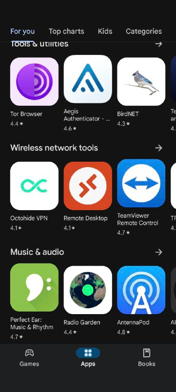

## Intro: Who am I

Bruno Rodrigues, head of the statistics department at the Ministry of Research
and Higher Education in Luxembourg

## Intro: Luxembourg?

{fig-align="center"}

## Intro: Luxembourg?

{fig-align="center"}

## Intro: where to find the code

Slides available online:

[https://b-rodrigues.github.io/repro_r_pharma](https://b-rodrigues.github.io/repro_r_pharma)

Code available here:

[https://github.com/b-rodrigues/repro_r_pharma](https://github.com/b-rodrigues/repro_r_pharma)

## What I'll be talking about

- Reproducibility of data projects

## Available solutions for R

- `{renv}` or `{groundhog}`: simple to use, but:
  - Doesn't save the R version
  - Installing old packages may fail (system dependencies)

- Docker goes further:
  - Manages R *and* system dependencies
  - Containers executable anywhere
- But:
  - Not inherently reproducible

## The Nix package manager (1/2)

Package manager: tool for installing and managing *packages*

Package: any software (not just R packages)

A popular package manager:

. . .



## The Nix package manager (2/2)

- To ensure reproducibility: R, R packages, and other dependencies must be
  explicitly managed
- Nix is a package manager truly focused on reproducible builds
- Nix manages everything using a single text file (called a Nix expression)!
- These expressions *always* produce exactly the same result

## rix: reproducible development environments with Nix (1/2)

- `{rix}` ([website](https://docs.ropensci.org/rix/)) simplifies writing Nix
  expressions!
- Just use the provided `rix()` function:

. . .

```{r, eval = FALSE}
library(rix)

rix(date = "2025-06-13",
    r_pkgs = c("dplyr", "ggplot2"),
    system_pkgs = NULL,
    git_pkgs = NULL,
    tex_pkgs = NULL,
    ide = "code",
    project_path = ".")
```

## rix: reproducible development environments with Nix (2/2)

- `rix::rix()` generates a `default.nix` file
- Build the expressions with `nix-build` (in terminal) or
  `rix::nix_build()` from R
- Access the development environment with `nix-shell`
- Expressions can be generated even without Nix installed (with some
  limitations)

## Polyglot environments with rix

- `rix()` supports Python and Julia alongside R:

. . .

```{r, eval = FALSE}
rix(date = "2025-06-09",
    r_pkgs = c("tidyr", "dplyr", "ggplot2", "languageserver"),
    py_conf = list(
      py_version = "3.13", 
      py_pkgs = c("polars", "scikit-learn")
    ),
    ide = "none",
    project_path = ".",
    overwrite = TRUE)
```

- Julia: use `jl_conf = list(jl_version = "1.10", jl_pkgs = c(...))`
- See: `scripts/nix_expressions/02_native_positron_example/`

## Demo

- Basics: `scripts/nix_expressions/01_rix_intro/`
- Native VS Code/Positron on Windows: `scripts/nix_expressions/02_native_positron_example/`
- Nix and `{targets}`: `scripts/nix_expressions/03_nix_targets_pipeline`
- Nix and Docker: `scripts/nix_expressions/04_docker/`
- Nix and `{shiny}`: `scripts/nix_expressions/05_shiny`
- GitHub Actions: [see here](https://github.com/b-rodrigues/rix_paper/tree/master)

## Polyglot pipelines with `{rixpress}`

- `{rixpress}` allows chaining processing steps in R, Python and Julia
- Uses `{rix}` to create a reproducible (via Nix) execution environment for the
  pipeline
- Each pipeline step is a **Nix derivation**
- Data transfer: automatic via `reticulate` or universal format (JSON)

## An example of a polyglot pipeline

```r
list(
  rxp_py_file(…),    # Read a CSV with Python
  rxp_py(…),         # Filter with Polars
  rxp_py2r(…),       # Python → R transfer
  rxp_r(…),          # Transformation in R
  rxp_r2py(…),       # R → Python transfer
  rxp_py(…),         # Another Python step
  rxp_py2r(…),       # Back to R
  rxp_r(…)           # Final step
) |> rixpress()
```

- Each step is named and typed (`py`, `r`, `r2py`, etc.)
- Ability to add files (`functions.R`, images…)

## To learn more about rixpress:

- [GitHub Repository](https://github.com/b-rodrigues/rixpress)
- [Website](https://b-rodrigues.github.io/rixpress/)
- [Repository of demos](https://github.com/b-rodrigues/rixpress_demos)

## T, a new DSL for polyglot data science

- Reproducibility is often an afterthought, with ad-hoc tools
- Nix eases the pain, but humans have to play ball! (biggest challenge)
- What could a "reproducible by design" language look like?
- This is T, a language whose package manager is Nix and pipelines are first-class citizens

## T is reproducible by design

- A new T project is a Nix project:

. . .


```bash
nix shell github:b-rodrigues/tlang codex/wire-agents.md-and-t-language-reference.md-in-init
```

. . .

```bash
t init --project
```

## T is reproducible by design

```text
my_analysis/
├── tproject.toml       # Project configuration and dependencies
├── flake.nix           # Reproducible environment definition
├── README.md           # Project overview
├── AGENTS.md           # Onboarding guide for AI Agents
├── T-LANGUAGE-REFERENCE.md # Tiered language reference for LLMs (git-ignored)
├── src/
│   └── pipeline.t      # Your main analysis script
├── data/               # Place your raw data files here
├── outputs/            # Output directory for results
└── tests/              # Unit tests for your analysis
```

## T is reproducible by design

- Add R, Python or Julia dependecies to `tproject.toml`
- Run `t update`
- Exit the temporary shell and run `nix develop`
- Environment is set up, ready to use!
- What pipelines look like [see here](https://github.com/b-rodrigues/t_demos/tree/master/r_py_xgboost_t)

## Learning a new language in 2026?!

- Learning a new language just for pipelines? Never!!
- T is built to be *llm-friendly*
- Projects ship `AGENTS.md`, `T-LANGUAGE-REFERENCE.md` and `src/pipeline.t` itself is a cheatsheet
- LLMs should be able to wire your project using T without much issue!

## Caveat Emptor

- This is a 100% vibe-coded side-project by yours truly...
- ...but throughly tested (2000+ unit tests and 60+ end-to-end tests)
- I wanted to stress-test the idea of a "reproducible by design" language
- Challenges: input/output between languages


## Fin

Contact me if you have questions:

- bruno@brodrigues.co
- Twitter: [@brodriguesco](https://x.com/brodriguesco)
- Mastodon: [@brodriguesco@fosstodon.org](https://fosstodon.org/@brodriguesco)
- Blog: [www.brodrigues.co](https://brodrigues.co/)
- Book: [www.raps-with-r.dev](https://raps-with-r.dev/)
- rix: [https://docs.ropensci.org/rix](https://docs.ropensci.org/rix)
- rixpress: [https://b-rodrigues.github.io/rixpress/](https://b-rodrigues.github.io/rixpress/)
- T: [https://tstats-project.org/](https://tstats-project.org/)
. . .

Thanks!
